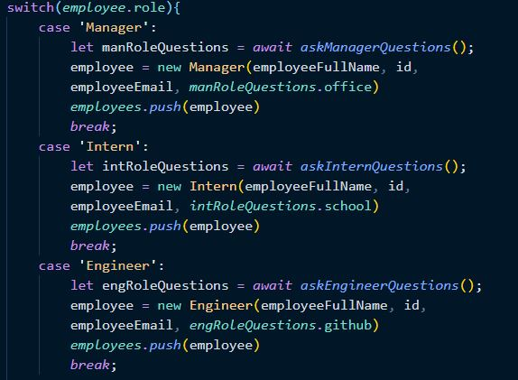

# TeamBuilder
  
  ## Description 
      This is an interactive application through the command line that allows a person to build cards that store employee information.
## Table of Contents
1.[Usage](#Usage)
2.[Contribution](#Contribution)
3.[Questions](#Questions)
## Usage
    This Application can be practiaclly applied to generate pertinent information for a team, so that all useful information is available for all to see. 

Via npm package Inquirer, the user is prompted to answer questions to fill cards that will save employee information.

Via this switch case, the questions change depending on the user's role as selected.

This sends the information to a javascript script that generates the HTML.

[Here](https://drive.google.com/file/d/1hKOo4gqdsftpjTADSxSCfhZozxDSGA63/view) is a video walkthrough.

## Installation Requirements
    This application requires npm packages inquirer, and express.            
## Contribution 
    Please contact Ben de Garcia to assist with future iterations.
## Questions
  
If you have questions, contact me at [GitHub](https://github.com/bdegarcia).

